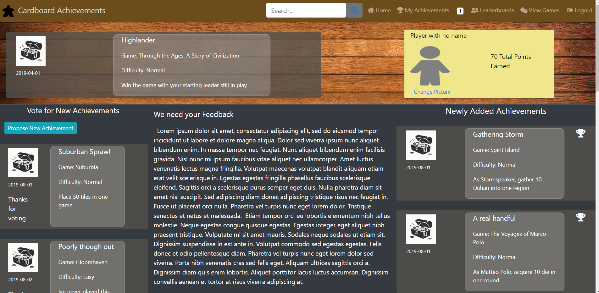

Cardboard Achievements is a project inspired by the 'achievement systems' for XBox, Playstation, and Steam.  It is an effort to bring a similar system to the tabletop space for boardgames and cardgames.  

The project was built using Microsoft .Net Core utilizing C# for its API backend, MSSQL Server for its database, and React framework for the user front-end.

To access the deployed site visit http://cardboardachievements.azurewebsites.net.

To build this project locally you will need to follow the following steps:

1.  Clone the project to a local repo. 

2.  Run the seed script in MSSQL Server to create the local database.  

3.  Within the ClientApp directory, run npm install.

4.  Within the root directory in Visual Studio, install hangfire and Dapper from the nuget package manager.

5.  Create a project in Firebase and enable email/password authentication.

6.  Copy the firebase api keys into the apiKeys.js file.

7.  Copy the port you will be serving from locally into the baseURL portion of the apiKeys file.

8.  Build the project in Visual Studio and open a browser to localhost on your served port.

## Screenshots

